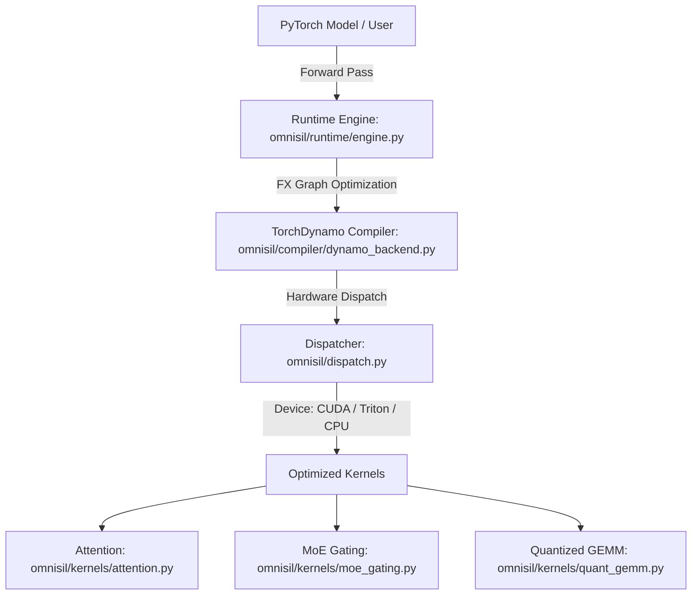

# OmniSil Runtime System Specification (`spec.md`)

## 1. System Overview
OmniSil Runtime is a hardware-agnostic numerical engine and compilation runtime designed to execute custom deep learning kernels (Attention, MoE Gating, Quantized GEMM) across heterogeneous silicon backends (`CUDA`, `Triton`, `CPU`) via unified dispatch and TorchDynamo compilation.

## 2. Kernel & Dispatch Architecture

## 3. Kernel Specifications & Tolerances
### `attention.py` (`flash_attention_kernel`)
- **Inputs**: Query (`Q`), Key (`K`), Value (`V`) tensors of shape `(batch_size, num_heads, seq_len, head_dim)`.
- **Invariants**: Must compute scaled dot-product attention `softmax(Q @ K.T / sqrt(d)) @ V` with memory-efficient tiling. Max relative tolerance `rtol=1e-3`.

### `moe_gating.py` (`topk_gating_kernel`)
- **Inputs**: Router logits tensor of shape `(num_tokens, num_experts)`.
- **Invariants**: Computes `Top-K` expert routing probabilities and dispatch indices with zero token dropping.

### `quant_gemm.py` (`int4_quantized_gemm`)
- **Inputs**: Activations (`FP16/FP32`) and Quantized Weights (`INT4` packed tensor + FP16 scales).
- **Invariants**: Dequantizes INT4 blocks on the fly into FP16 accumulators before GEMM multiplication, ensuring `4x` memory reduction with `< 0.5%` perplexity degradation.
